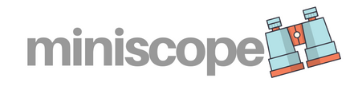
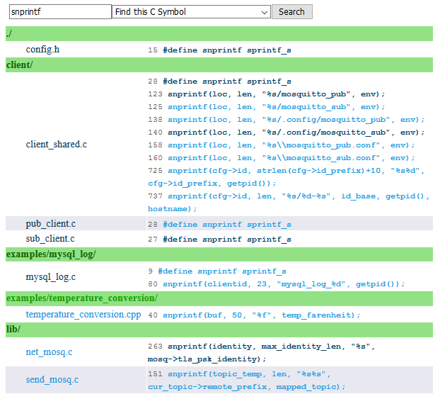
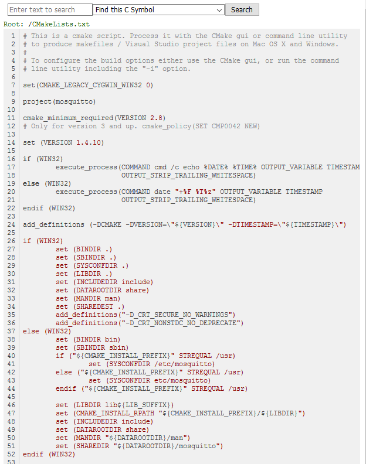

# 

[](https://goreportcard.com/report/github.com/edwardchoh/miniscope/)
[](https://github.com/edwardchoh/miniscope/blob/master/LICENSE)

miniscope is a code explorer, powered by cscope and Golang. This is inspired by code search and cross reference engine like OpenGrok.

It comes as a single, batteries-included, static binary. No need to install OpenGrok, all you need is to index your code with cscope beforehand.

## Features

- HTML interface for cscope
- Colors! Syntax highlighting!
- Easy to use and install
- No dependencies or external files needed -- apart from the single binary
- Uses your existing cscope database

This is a screenshot of query results, all cscope query types are supported.



Another screenshot of viewing a file, syntax highlighting is enabled for common file types.



## Installation

### Prebuilt binaries

Not available yet.

## Usage

Execute miniscope from a directory with a cscope.out file, or specify it on the command line:

```
miniscope --path $HOME/src/project/ --addr ":8080"
```

## Development

### Building from source

Make sure you have Go 1.5 or greater installed.

```
go install github.com/edwardchoh/miniscope/cmd/miniscope
```

Whenever assets have changed, assets.go need to be generated.

````
go get -u github.com/jteeuwen/go-bindata/...
go generate ./...
````

### Multi-architecture compilation

````
GOOS=freebsd GOARCH=amd64 go build -o miniscope-freebsd-amd64 -x cmd/miniscope/main.go
````

## Licenses

This project embeds resources from:
* [highlight.js](https://github.com/isagalaev/highlight.js)
* [highlightjs-line-numbers](https://github.com/wcoder/highlightjs-line-numbers.js)